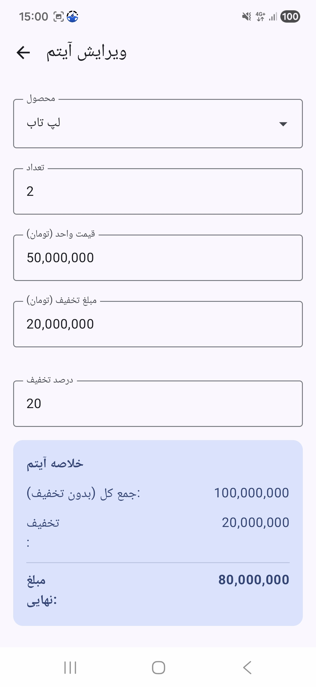

# برنامه فاکتور فروش

این یک پروژه نمونه اندروید برای مدیریت و صدور فاکتور فروش است که با استفاده از **Kotlin** و **Jetpack Compose** و معماری **MVVM** توسعه داده شده است.

## ویژگی‌ها

## تصاویر محیط برنامه (Screenshots)

### صفحه اصلی (لیست آیتم‌ها و مشخصات مشتری)

### صفحه افزودن/ویرایش آیتم

